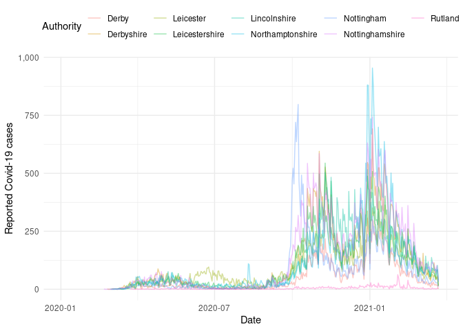

# Subnational data for the Covid-19 outbreak

[](https://mybinder.org/v2/gh/epiforecasts/covidregionaldata/master?urlpath=rstudio)
[](https://github.com/epiforecasts/covidregionaldata/actions)
[](https://codecov.io/gh/epiforecasts/covidregionaldata?branch=master)
[](https://github.com/epiforecasts/covidregionaldata/)
[](https://zenodo.org/badge/latestdoi/271601189)
[](https://cran.r-project.org/package=covidregionaldata)

An interface to subnational and national level Covid-19 data. For all
countries supported, this includes a daily time-series of cases.
Wherever available we also provide data on deaths, hospitalisations, and
tests. National level data is also supported using a range of data
sources as well as linelist data and links to intervention data sets.

## Installation

Install from CRAN:

``` r
install.packages("covidregionaldata")
```

Install the stable development version of the package with:

``` r
install.packages("drat")
drat:::add("epiforecasts")
install.packages("covidregionaldata")
```

Install the unstable development version of the package with:

``` r
remotes::install_github("epiforecasts/covidregionaldata")
```

## Quick start

[](https://epiforecasts.io/covidregionaldata/)

Load `covidregionaldata`, `dplyr`, `scales`, and `ggplot2` (all used in
this quick start),

``` r
library(covidregionaldata)
library(dplyr)
library(ggplot2)
library(scales)
```

### Setup Data caching

This package can optionally use a data cache from `memoise` to locally
cache downloads. This can be enabled using the following (this will use
a `.cache` in the current directory),

``` r
start_using_memoise()
```

To stop using `memoise` use,

``` r
stop_using_memoise()
```

and to reset the cache (required to download new data),

``` r
reset_cache()
```

### National data

To get worldwide time-series data by country (sourced from the WHO),
use:

``` r
nots <- get_national_data()
#> Processing data for who by country
#> Downloading data
#> Cleaning data
#> Processing data
nots
#> # A tibble: 105,492 x 15
#>    date       un_region who_region country        iso_code cases_new cases_total
#>    <date>     <chr>     <chr>      <chr>          <chr>        <dbl>       <dbl>
#>  1 2020-01-03 Asia      EMRO       Afghanistan    AF               0           0
#>  2 2020-01-03 Europe    EURO       Albania        AL               0           0
#>  3 2020-01-03 Africa    AFRO       Algeria        DZ               0           0
#>  4 2020-01-03 Oceania   WPRO       American Samoa AS               0           0
#>  5 2020-01-03 Europe    EURO       Andorra        AD               0           0
#>  6 2020-01-03 Africa    AFRO       Angola         AO               0           0
#>  7 2020-01-03 Americas  AMRO       Anguilla       AI               0           0
#>  8 2020-01-03 Americas  AMRO       Antigua & Bar… AG               0           0
#>  9 2020-01-03 Americas  AMRO       Argentina      AR               0           0
#> 10 2020-01-03 Asia      EURO       Armenia        AM               0           0
#> # … with 105,482 more rows, and 8 more variables: deaths_new <dbl>,
#> #   deaths_total <dbl>, recovered_new <int>, recovered_total <int>,
#> #   hosp_new <int>, hosp_total <int>, tested_new <int>, tested_total <int>
```

This can also be filtered for a country of interest,

``` r
get_national_data(country = "France", verbose = FALSE)
#> # A tibble: 447 x 15
#>    date       un_region who_region country iso_code cases_new cases_total
#>    <date>     <chr>     <chr>      <chr>   <chr>        <dbl>       <dbl>
#>  1 2020-01-03 Europe    EURO       France  FR               0           0
#>  2 2020-01-04 Europe    EURO       France  FR               0           0
#>  3 2020-01-05 Europe    EURO       France  FR               0           0
#>  4 2020-01-06 Europe    EURO       France  FR               0           0
#>  5 2020-01-07 Europe    EURO       France  FR               0           0
#>  6 2020-01-08 Europe    EURO       France  FR               0           0
#>  7 2020-01-09 Europe    EURO       France  FR               0           0
#>  8 2020-01-10 Europe    EURO       France  FR               0           0
#>  9 2020-01-11 Europe    EURO       France  FR               0           0
#> 10 2020-01-12 Europe    EURO       France  FR               0           0
#> # … with 437 more rows, and 8 more variables: deaths_new <dbl>,
#> #   deaths_total <dbl>, recovered_new <int>, recovered_total <int>,
#> #   hosp_new <int>, hosp_total <int>, tested_new <int>, tested_total <int>
```

Using this data we can compare case information between countries, for
example here is the number of deaths over time for each country in the
G7:

``` r
g7 <- c(
  "United States", "United Kingdom", "France", "Germany",
  "Italy", "Canada", "Japan"
)
nots %>%
  filter(country %in% g7) %>%
  ggplot() +
  aes(x = date, y = deaths_new, col = country) +
  geom_line(alpha = 0.4) +
  labs(x = "Date", y = "Reported Covid-19 deaths") +
  scale_y_continuous(labels = comma) +
  theme_minimal() +
  theme(legend.position = "top") +
  guides(col = guide_legend(title = "Country"))
```


### Subnational data

To get time-series data for subnational regions of a specific country,
for example by level 1 region in the UK, use:

``` r
uk_nots <- get_regional_data(country = "UK", verbose = FALSE)
uk_nots
#> # A tibble: 5,811 x 26
#>    date       region           ons_region_code cases_new cases_total deaths_new
#>    <date>     <chr>            <chr>               <dbl>       <dbl>      <dbl>
#>  1 2020-01-03 East Midlands    E12000004              NA          NA         NA
#>  2 2020-01-03 East of England  E12000006              NA          NA         NA
#>  3 2020-01-03 England          E92000001              NA          NA         NA
#>  4 2020-01-03 London           E12000007              NA          NA         NA
#>  5 2020-01-03 North East       E12000001              NA          NA         NA
#>  6 2020-01-03 North West       E12000002              NA          NA         NA
#>  7 2020-01-03 Northern Ireland N92000002              NA          NA         NA
#>  8 2020-01-03 Scotland         S92000003              NA          NA         NA
#>  9 2020-01-03 South East       E12000008              NA          NA         NA
#> 10 2020-01-03 South West       E12000009              NA          NA         NA
#> # … with 5,801 more rows, and 20 more variables: deaths_total <dbl>,
#> #   recovered_new <int>, recovered_total <int>, hosp_new <dbl>,
#> #   hosp_total <dbl>, tested_new <dbl>, tested_total <dbl>, areaType <chr>,
#> #   newCasesBySpecimenDate <dbl>, cumCasesBySpecimenDate <dbl>,
#> #   newCasesByPublishDate <dbl>, cumCasesByPublishDate <dbl>,
#> #   newDeaths28DaysByPublishDate <dbl>, cumDeaths28DaysByPublishDate <dbl>,
#> #   newDeaths28DaysByDeathDate <dbl>, cumDeaths28DaysByDeathDate <dbl>,
#> #   newPillarOneTestsByPublishDate <dbl>, newPillarTwoTestsByPublishDate <dbl>,
#> #   newPillarThreeTestsByPublishDate <dbl>,
#> #   newPillarFourTestsByPublishDate <lgl>
```

Now we have the data we can create plots, for example the time-series of
the number of cases for each region:

``` r
uk_nots %>%
  filter(!(region %in% "England")) %>%
  ggplot() +
  aes(x = date, y = cases_new, col = region) +
  geom_line(alpha = 0.4) +
  labs(x = "Date", y = "Reported Covid-19 cases") +
  scale_y_continuous(labels = comma) +
  theme_minimal() +
  theme(legend.position = "top") +
  guides(col = guide_legend(title = "Region"))
```


We can also explore data for level 2 regions (here Upper-tier local
authorities),

``` r
uk_nots_2 <- get_regional_data(country = "UK", level = "2", verbose = FALSE)
uk_nots_2
#> # A tibble: 95,658 x 24
#>    date       authority   ltla_code region ons_region_code cases_new cases_total
#>    <date>     <chr>       <chr>     <chr>  <chr>               <dbl>       <dbl>
#>  1 2020-01-03 Aberdeen C… S12000033 Scotl… S92000003              NA          NA
#>  2 2020-01-03 Aberdeensh… S12000034 Scotl… S92000003              NA          NA
#>  3 2020-01-03 Angus       S12000041 Scotl… S92000003              NA          NA
#>  4 2020-01-03 Antrim and… N09000001 North… N92000002              NA          NA
#>  5 2020-01-03 Ards and N… N09000011 North… N92000002              NA          NA
#>  6 2020-01-03 Argyll and… S12000035 Scotl… S92000003              NA          NA
#>  7 2020-01-03 Armagh Cit… N09000002 North… N92000002              NA          NA
#>  8 2020-01-03 Barking an… E09000002 London E12000007              NA          NA
#>  9 2020-01-03 Barnet      E09000003 London E12000007              NA          NA
#> 10 2020-01-03 Barnsley    E08000016 Yorks… E12000003              NA          NA
#> # … with 95,648 more rows, and 17 more variables: deaths_new <dbl>,
#> #   deaths_total <dbl>, recovered_new <int>, recovered_total <int>,
#> #   hosp_new <int>, hosp_total <int>, tested_new <int>, tested_total <int>,
#> #   areaType <chr>, newCasesBySpecimenDate <dbl>, cumCasesBySpecimenDate <dbl>,
#> #   newCasesByPublishDate <dbl>, cumCasesByPublishDate <dbl>,
#> #   newDeaths28DaysByPublishDate <dbl>, cumDeaths28DaysByPublishDate <dbl>,
#> #   newDeaths28DaysByDeathDate <dbl>, cumDeaths28DaysByDeathDate <dbl>
```

now as an example we can plot cases in the East Midlands,

``` r
uk_nots_2 %>%
  filter(region %in% c("East Midlands")) %>%
  ggplot() +
  aes(x = date, y = cases_new, col = authority) +
  geom_line(alpha = 0.4) +
  labs(x = "Date", y = "Reported Covid-19 cases") +
  scale_y_continuous(labels = comma) +
  theme_minimal() +
  theme(legend.position = "top") +
  guides(col = guide_legend(title = "Authority"))
```



Level 2 data is only available for some countries, see
`get_available_datasets` for supported nations. For further examples see
the [quick start
vignette](https://github.com/epiforecasts/covidregionaldata/blob/master/vignettes/quickstart.Rmd)

## Dataset status

| **Dataset** |                                                                               **GitHub status**                                                                               | *CRAN status* |
| :---------- | :---------------------------------------------------------------------------------------------------------------------------------------------------------------------------: | :-----------: |
| WHO         |       [](https://github.com/epiforecasts/covidregionaldata/actions/workflows/who.yaml)       |   *working*   |
| ECDC        |     [](https://github.com/epiforecasts/covidregionaldata/actions/workflows/ecdc.yaml)      |   *working*   |
| Mexico      |  [](https://github.com/epiforecasts/covidregionaldata/actions/workflows/mexico.yaml)   |   *working*   |
| Italy       |    [](https://github.com/epiforecasts/covidregionaldata/actions/workflows/italy.yaml)    |   *working*   |
| Germany     | [](https://github.com/epiforecasts/covidregionaldata/actions/workflows/germany.yaml) |   *working*   |

## Development

We welcome contributions and new contributors\! We particularly
appreciate help adding new data sources for countries at sub-national
level, or work on priority problems in the
[issues](https://github.com/epiforecasts/covidregionaldata/issues).
Please check and add to the issues, and/or add a [pull
request](https://github.com/epiforecasts/covidregionaldata/pulls). For
more details, start with the [contributing
guide](https://github.com/epiforecasts/covidregionaldata/tree/master/.github/contributing.md).
