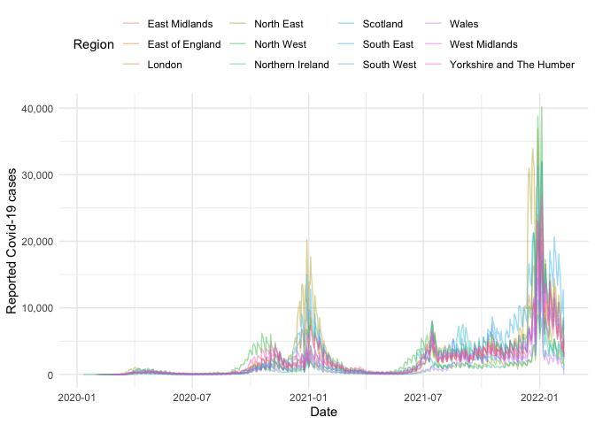

# Subnational data for the COVID-19 outbreak

[](https://lifecycle.r-lib.org/articles/stages.html)
[](https://github.com/epiforecasts/covidregionaldata/actions)
[](https://codecov.io/gh/epiforecasts/covidregionaldata?branch=master)
[](https://epiforecasts.io/covidregionaldata/articles/dataset-status.html)
[](https://cran.r-project.org/package=covidregionaldata)

[](https://github.com/epiforecasts/covidregionaldata/blob/master/LICENSE.md/)
[](https://github.com/epiforecasts/covidregionaldata/graphs/contributors)
[](https://makeapullrequest.com/)
[](https://GitHub.com/epiforecasts/covidregionaldata/commit/master/)
[](https://zenodo.org/badge/latestdoi/271601189)

An interface to subnational and national level COVID-19 data. For all
countries supported, this includes a daily time-series of cases.
Wherever available we also provide data on deaths, hospitalisations, and
tests. National level data is also supported using a range of data
sources as well as line list data and links to intervention data sets.

## Installation

Install from CRAN:

``` r
install.packages("covidregionaldata")
```

Install the stable development version of the package with:

``` r
install.packages("drat")
drat:::add("epiforecasts")
install.packages("covidregionaldata")
```

Install the unstable development version of the package with:

``` r
remotes::install_github("epiforecasts/covidregionaldata")
```

## Quick start

[](https://epiforecasts.io/covidregionaldata/)

Load `covidregionaldata`, `dplyr`, `scales`, and `ggplot2` (all used in
this quick start),

``` r
library(covidregionaldata)
library(dplyr)
#> Warning: package 'dplyr' was built under R version 4.0.4
library(ggplot2)
library(scales)
```

### Setup data caching

This package can optionally use a data cache from `memoise` to locally
cache downloads. This can be enabled using the following (this will use
the temporary directory by default),

``` r
start_using_memoise()
#> Using a cache at: /tmp/RtmpP7lBGr
```

To stop using `memoise` use,

``` r
stop_using_memoise()
```

and to reset the cache (required to download new data),

``` r
reset_cache()
```

### National data

To get worldwide time-series data by country (sourced from the World
Health Organisation (WHO) by default by also optionally from the
European Centre for Disease Control (ECDC), John Hopkins University, or
the Google COVID-19 open data project), use:

``` r
nots <- get_national_data()
#> Downloading data from https://covid19.who.int/WHO-COVID-19-global-data.csv
#> Rows: 116,255
#> Columns: 8
#> Delimiter: ","
#> chr  [3]: Country_code, Country, WHO_region
#> dbl  [4]: New_cases, Cumulative_cases, New_deaths, Cumulative_deaths
#> date [1]: Date_reported
#> 
#> Use `spec()` to retrieve the guessed column specification
#> Pass a specification to the `col_types` argument to quiet this message
#> Cleaning data
#> Processing data
nots
#> # A tibble: 116,366 x 15
#>    date       un_region who_region country        iso_code cases_new cases_total
#>    <date>     <chr>     <chr>      <chr>          <chr>        <dbl>       <dbl>
#>  1 2020-01-03 Asia      EMRO       Afghanistan    AF               0           0
#>  2 2020-01-03 Europe    EURO       Albania        AL               0           0
#>  3 2020-01-03 Africa    AFRO       Algeria        DZ               0           0
#>  4 2020-01-03 Oceania   WPRO       American Samoa AS               0           0
#>  5 2020-01-03 Europe    EURO       Andorra        AD               0           0
#>  6 2020-01-03 Africa    AFRO       Angola         AO               0           0
#>  7 2020-01-03 Americas  AMRO       Anguilla       AI               0           0
#>  8 2020-01-03 Americas  AMRO       Antigua & Bar… AG               0           0
#>  9 2020-01-03 Americas  AMRO       Argentina      AR               0           0
#> 10 2020-01-03 Asia      EURO       Armenia        AM               0           0
#> # … with 116,356 more rows, and 8 more variables: deaths_new <dbl>,
#> #   deaths_total <dbl>, recovered_new <dbl>, recovered_total <dbl>,
#> #   hosp_new <dbl>, hosp_total <dbl>, tested_new <dbl>, tested_total <dbl>
```

This can also be filtered for a country of interest,

``` r
g7 <- c(
  "United States", "United Kingdom", "France", "Germany",
  "Italy", "Canada", "Japan"
)
g7_nots <- get_national_data(countries = g7, verbose = FALSE)
```

Using this data we can compare case information between countries, for
example here is the number of deaths over time for each country in the
G7:

``` r
g7_nots %>%
  ggplot() +
  aes(x = date, y = deaths_new, col = country) +
  geom_line(alpha = 0.4) +
  labs(x = "Date", y = "Reported Covid-19 deaths") +
  scale_y_continuous(labels = comma) +
  theme_minimal() +
  theme(legend.position = "top") +
  guides(col = guide_legend(title = "Country"))
```


### Subnational data

To get time-series data for subnational regions of a specific country,
for example by level 1 region in the UK, use:

``` r
uk_nots <- get_regional_data(country = "UK", verbose = FALSE)
uk_nots
#> # A tibble: 6,019 x 26
#>    date       region   region_code cases_new cases_total deaths_new deaths_total
#>    <date>     <chr>    <chr>           <dbl>       <dbl>      <dbl>        <dbl>
#>  1 2020-01-30 East Mi… E12000004          NA          NA         NA           NA
#>  2 2020-01-30 East of… E12000006          NA          NA         NA           NA
#>  3 2020-01-30 England  E92000001           2           2         NA           NA
#>  4 2020-01-30 London   E12000007          NA          NA         NA           NA
#>  5 2020-01-30 North E… E12000001          NA          NA         NA           NA
#>  6 2020-01-30 North W… E12000002          NA          NA         NA           NA
#>  7 2020-01-30 Norther… N92000002          NA          NA         NA           NA
#>  8 2020-01-30 Scotland S92000003          NA          NA         NA           NA
#>  9 2020-01-30 South E… E12000008          NA          NA         NA           NA
#> 10 2020-01-30 South W… E12000009          NA          NA         NA           NA
#> # … with 6,009 more rows, and 19 more variables: recovered_new <dbl>,
#> #   recovered_total <dbl>, hosp_new <dbl>, hosp_total <dbl>, tested_new <dbl>,
#> #   tested_total <dbl>, areaType <chr>, cumCasesByPublishDate <dbl>,
#> #   cumCasesBySpecimenDate <dbl>, newCasesByPublishDate <dbl>,
#> #   newCasesBySpecimenDate <dbl>, cumDeaths28DaysByDeathDate <dbl>,
#> #   cumDeaths28DaysByPublishDate <dbl>, newDeaths28DaysByDeathDate <dbl>,
#> #   newDeaths28DaysByPublishDate <dbl>, newPillarFourTestsByPublishDate <lgl>,
#> #   newPillarOneTestsByPublishDate <dbl>,
#> #   newPillarThreeTestsByPublishDate <dbl>,
#> #   newPillarTwoTestsByPublishDate <dbl>
```

Now we have the data we can create plots, for example the time-series of
the number of cases for each region:

``` r
uk_nots %>%
  filter(!(region %in% "England")) %>%
  ggplot() +
  aes(x = date, y = cases_new, col = region) +
  geom_line(alpha = 0.4) +
  labs(x = "Date", y = "Reported Covid-19 cases") +
  scale_y_continuous(labels = comma) +
  theme_minimal() +
  theme(legend.position = "top") +
  guides(col = guide_legend(title = "Region"))
```



See `get_available_datasets()` for supported regions and subregional
levels. For further examples see the [quick start
vignette](https://github.com/epiforecasts/covidregionaldata/blob/master/vignettes/quickstart.Rmd).
Additional subnational data are supported via the `JHU()` and `Google()`
classes. Use the `available_regions()` method once these data have been
downloaded and cleaned (see their examples) for subnational data they
internally support.

## Citation

If using `covidregionaldata` in your work please consider citing it
using the following,

    #> 
    #> To cite covidregionaldata in publications use:
    #> 
    #>   Sam Abbott, Katharine Sherratt, Joe Palmer, Richard Martin-Nielsen,
    #>   Jonnie Bevan, Hamish Gibbs, and Sebastian Funk (2020).
    #>   covidregionaldata: Subnational Data for the COVID-19 Outbreak, DOI:
    #>   10.5281/zenodo.3957539
    #> 
    #> A BibTeX entry for LaTeX users is
    #> 
    #>   @Article{,
    #>     title = {covidregionaldata: Subnational Data for the COVID-19 Outbreak},
    #>     author = {Sam Abbott and Katharine Sherratt and Joe Palmer and Richard Martin-Nielsen and Jonnie Bevan and Hamish Gibbs and Sebastian Funk},
    #>     journal = {-},
    #>     year = {2020},
    #>     volume = {-},
    #>     number = {-},
    #>     pages = {-},
    #>     doi = {10.5281/zenodo.3957539},
    #>   }

## Development

[](https://github.com/epiforecasts/covidregionaldata/wiki/)

We welcome contributions and new contributors\! We particularly
appreciate help adding new data sources for countries at sub-national
level, or work on priority problems in the
[issues](https://github.com/epiforecasts/covidregionaldata/issues).
Please check and add to the issues, and/or add a [pull
request](https://github.com/epiforecasts/covidregionaldata/pulls). For
more details, start with the [contributing
guide](https://github.com/epiforecasts/covidregionaldata/wiki/Contributing).
For details of the steps required to add support for a dataset see the
[adding data
guide](https://github.com/epiforecasts/covidregionaldata/wiki/Adding-Data).
