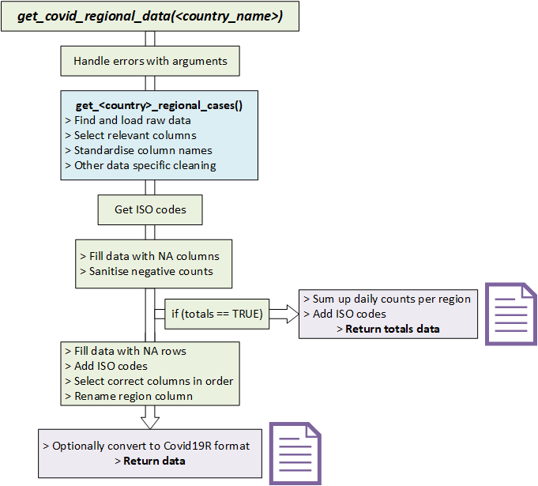

# NCoVUtils System Maintenance Guide

## Using this Guide
This guide is for those wishing to contribute code to the NCoVUtils package. For details on how the package works and its general functionality, as well as installation, see the main README.md file in this repository. 

We are working to improve and expand the package: please see the [Issues](https://github.com/epiforecasts/NCoVUtils/issues) and feel free to comment. We are keen to standardise geocoding (issues [#81](https://github.com/epiforecasts/NCoVUtils/issues/81) and [#84](https://github.com/epiforecasts/NCoVUtils/issues/84)) and include data on priority countries ([#72](https://github.com/epiforecasts/NCoVUtils/issues/72)). As our capacity is limited, we would very much appreciate any help on these and welcome new pull requests.

## Set up
Set your working directory to the home directory of this project (or use the provided Rstudio project). Install the analysis and all dependencies with:
```r
remotes::install_github("epiforecasts/NCoVUtils", dependencies = TRUE)
```

### Render documentation
Render the documentation with the following:
```bash
Rscript inst/scripts/render_output.R
```

### Docker
This package is developed in a docker container based on the tidyverse docker image.

To build the docker image run (from the `NCoVUtils` directory):
```bash
docker build . -t ncovutils
```

To run the docker image run:
```bash
docker run -d -p 8787:8787 --name ncovutils -e USER=ncovutils -e PASSWORD=ncovutils ncovutils
```

The rstudio client can be found on port :8787 at your local machines IP. The default username:password is ncovutils:ncovutils, set the user with -e USER=username, and the password with - e PASSWORD=newpasswordhere. The default is to save the analysis files into the user directory.

To mount a folder (from your current working directory - here assumed to be `tmp`) in the docker container to your local system use the following in the above docker run command (as given mounts the whole `ncovutils` directory to `tmp`).

```{bash, eval = FALSE}
--mount type=bind,source=$(pwd)/tmp,target=/home/ncovutils
```

To access the command line run the following:
```{bash, eval = FALSE}
docker exec -ti ncovutils bash
```

Alternatively the package environment can be accessed via [binder](https://mybinder.org/v2/gh/epiforecasts/ncovutils/master?urlpath=rstudio).

## Development
### Architecture
NCoVUtils has one main data getter function which returns the same data (for each country) in different formats dependent on arguments that are passed in.

The getter follows the following steps (see picture below for a diagram).

1. Handling errors related to arguments.
2. Getting data using the `get_<country>_regional_cases()` function for the relevant country.
3. Getting the ISO codes for the country using `get_iso_codes(<country>)`
4. Cleaning the data using some of the helper functions.
5. _If_ the user requested totals only, summing up the data per region and returning the totals data.
6. _If not_, further cleaning using the helper functions.
7. Returning data in the requested (long or wide) format.




### Common Tasks
#### **Adding a new country to the `get_regional_covid_data()` function**
This is the most common task for developers. You will need a source of raw data before starting. Note that for the data to be suitable it must be:

+ reliable, valid and accurate 
+ updated daily
+ at a sub-region level (i.e. states, counties, provinces)
+ publicly available

You then need to follow these steps:

1. Create a `get_<country>_regional_cases()` function. As described above, this needs to load the raw data, select *only* the relevant columns and change the names of the columns to the package standards. For some countries there may be multiple data sources, in which case using the `dplyr` join functions is recommended. There is no need to deal with NA values at this point, or to calculate new data.

2. Create unit tests for the function. At a minimum you should have tests which:
+ check if the data source is there, returns data and returns the expected columns
+ check that your function returns data columns with the correct names
+ check that your function returns data columns of the correct type (double for count data, character for metadata and Date for dates)

3. Write documentation using `#'` roxygen styling and then call `roxygen2::roxygenise()` when done to update the manual and NAMESPACE. There is no need to export your function but be sure to import any functions you do use from other packages.

4. Add your function in the switch() calls in the `get_regional_covid_data()`, `get_iso_codes()` and `rename_region_column()` functions. ISO-3166-2 codes can be found using Wikipedia.


#### **Writing new helper functions**
If you need to write new functionality for the package, and the same functionality already exists in a different function, it may make sense to take this functionality and put it into a separate function to save code. This approach is also helpful if there are long pieces of code which can be split into logical parts. 

If writing a helper function, follow these steps:

1. add your function to the `helpers.R` file. 

2. Write unit tests (as above). At a minimum you should have a test which takes generic data (of a similar format as the data that the function is designed to use) and tests that the function handles it correctly. If there is a chance that user actions could cause the function to fail, then have tests to ensure that the function fails as expected in these instances.

3. Write documentation using `#'` roxygen styling and then call `roxygen2::roxygenise()` when done to update the manual and NAMESPACE. There is no need to export your function but be sure to import any functions you do use from other packages.